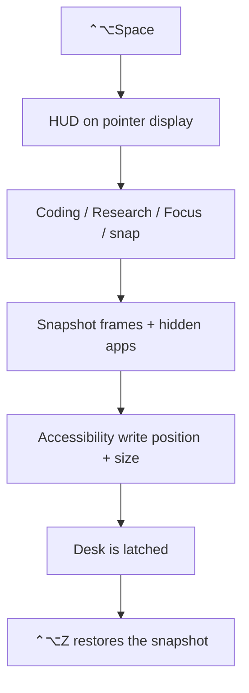

# Latch

**One chord. Your whole desk locks into place.**

[](#requirements)
[](Sources)
[](LICENSE)
[](#privacy)

Press `⌃⌥Space`. A glass HUD appears on the display under your pointer. Hit `C`
and the editor, browser, and terminal already open on that display snap into a
coding desk. `R` is research. `F` is focus — one window, everything else hides.
`Z` puts the last arrangement back.

Rectangle snaps one window. Latch applies a scene.

No account, no network, no telemetry.

---

## Try it

Requirements: macOS 14+, Apple Silicon, Xcode Command Line Tools, and a
code-signing identity on the machine.

```bash
git clone https://github.com/jmenzies722/latch.git
cd latch
make install
```

`make install` builds the bundle, signs it, copies it to `~/Applications`, and
opens it. Latch is menu-bar only — no Dock icon.

The first apply asks for **Accessibility**. Allow it. Latch never records the
screen and never sends anything anywhere.

**Find your `SIGN_ID`** with `security find-identity -v -p codesigning`. The
Makefile defaults to the identity this repo was built with; override it:

```bash
make install SIGN_ID="Apple Development: you@example.com (TEAMID)"
```

Without a stable identity, macOS treats each rebuild as a different app and
Accessibility silently stops working. If Settings says Latch is allowed but
windows do not move:

```bash
make unlock
```

That resets the grant (`tccutil reset Accessibility com.shualabs.latch`) and
reinstalls.

## Use

| Action | What happens |
| --- | --- |
| `⌃⌥Space` | HUD on the display under the pointer. Editor stays frontmost |
| `C` | **Coding** — editor ~2/3, browser and terminal stacked in the remaining 1/3 |
| `R` | **Research** — browser ~2/3, editor in the remaining 1/3. Terminal stays put |
| `F` | **Focus** — frontmost window fills the display; other apps hide |
| `←` `→` | Left / right half |
| `⌥←` `⌥→` | Left / right two-thirds |
| `4` `5` `6` | Thirds |
| `U` `I` `J` `K` | Quarters |
| `M` | Maximize |
| `1` `2` `3` | Restore a saved desk |
| `⇧1` `⇧2` `⇧3` | Save the current desk into that slot |
| `⌃⌥Z` / `Z` | Undo the last layout (one level) |
| Esc | Dismiss the HUD |

Roles are matched by bundle ID: Cursor / VS Code / Xcode / Zed / Sublime /
JetBrains as the editor; Safari / Chrome / Arc / Firefox / Brave / Edge as the
browser; Terminal / iTerm / Ghostty / Warp / Alacritty / kitty as the terminal.
Missing roles leave that slot empty. Extra windows of the same role are left
alone. Latch never launches an app.

Shortcuts are remappable in Settings. Launch at login is off until you turn it
on.

## How it works



Window frames are Accessibility attributes, the same surface Relay uses. Geometry,
role matching, and snapshot restore live in `LatchCore` and are unit-tested
without a GUI session. The app is a signed `LSUIElement` accessory: menu extra
plus a non-activating HUD, so the editor you were in stays the frontmost app
until you type a HUD key.

## Why it exists

Snapping the frontmost window is a solved problem. The thing that still costs
time is rebuilding a *desk* — editor large, browser and terminal in the gap,
or one window and silence — every time you sit down. Latch is the scene button.

## Privacy

No analytics, no crash reporter, no account, no network calls of any kind.
Saved desks live at `~/Library/Application Support/Latch/` and nowhere else.

## Tests

```bash
make test
```

Compiles and runs `LatchCore` tests: snap math, coding/research slots,
bundle-ID roles, and snapshot matching. Accessibility is not required.

## Deliberately not

A tiling window manager. Drag-to-edge snap. An app launcher. AI layout
suggestions. Windows or Linux. Cloud sync.

## Known limits

- **Accessibility required.** Unsigned or re-signed rebuilds drop the grant.
  Sign every install. `make unlock` is the hatch.
- **Apple Silicon, macOS 14+.** Built with `-target arm64-apple-macos14.0`.
- **No notarized release.** First launch on a Mac that did not build it may
  need Finder → right-click → Open.
- **Presets do not launch apps.** Restore is best-effort against what is
  already open. Missing windows are skipped.
- **Coexists with Rectangle / Magnet.** Latch does not install an edge-drag
  tap. Pick one for arrow-key snaps if the chords collide.

## License

[MIT](LICENSE)
