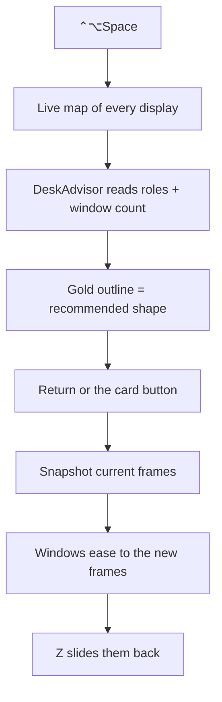

# Latch

**A screen organizer for the Mac. It watches every display, recommends a desk shape, and slides the windows you already have into it.**

[](#try-it)
[](Sources)
[](LICENSE)
[](#privacy)

Latch is a menu-bar app. Press `⌃⌥Space` and you get a live map of each screen — every open window as a block, where it actually sits. Gold dashed lines are the shape Latch wants that desk to take. Hit Return and those windows ease into place.

It does not open apps. It does not tile every new window forever. It organizes what’s already there.

Rectangle snaps the frontmost window. Latch applies a whole desk.

No account, no network, no telemetry.

---

## What you see

Each display gets a card:

- **Live map** — windows drawn in place, updating as you move them. Drag a tile and the real window comes with your hand.
- **Recommended shape** — a gold outline on top of the map, plus a one-liner (“Cursor, Safari, and Terminal are already a trio”).
- **Latch button** — commits that screen. Return commits the display under your pointer.

Hover **C / R / F** to preview a different desk on the pointer screen before you commit. The HUD fades in; windows slide (~200ms), not teleport.

## The shapes

Latch looks at what’s open on a display and picks one:

| Shape | When | What moves |
| --- | --- | --- |
| **Coding** | Editor + browser + terminal | Editor ~2/3. Browser and terminal stacked in the remaining third |
| **Research** | Browser + editor, no terminal | Browser large, editor beside it |
| **Focus** | Four or more windows, no obvious desk | Frontmost window fills the screen. Other apps hide |
| **Split** | Two windows | Fifty-fifty |
| **Maximize** | One window | It gets the whole visible frame |
| **Blank** | Nothing open | Latch waits |

You can override the pick: `C` coding, `R` research, `F` focus, or the snap keys for a single window.

**Editor** means Cursor, VS Code, Xcode, Zed, Sublime, JetBrains. **Browser** means Safari, Chrome, Arc, Firefox, Brave, Edge. **Terminal** means Terminal, iTerm, Ghostty, Warp, Alacritty, kitty. Missing roles leave that slot empty. Extra windows of the same role are left alone.

---

## Try it

Requirements: macOS 14+, Apple Silicon, Xcode Command Line Tools, and a code-signing identity on the machine.

```bash
git clone https://github.com/jmenzies722/latch.git
cd latch
make install
```

That builds the app, signs it, copies it to `~/Applications`, and opens it. Latch is menu-bar only — no Dock icon. A split-rectangle sits in the extra.

The first time you apply a layout, macOS asks for **Accessibility**. Allow it. Latch never records the screen and never sends anything anywhere.

**Find your `SIGN_ID`** with `security find-identity -v -p codesigning`. Override the Makefile default if you need to:

```bash
make install SIGN_ID="Apple Development: you@example.com (TEAMID)"
```

Accessibility is bound to the *code signature*, not the file path. Rebuild without a stable identity and windows silently stop moving. If Settings says Latch is allowed but nothing happens:

```bash
make unlock
```

That resets the grant (`tccutil reset Accessibility com.shualabs.latch`) and reinstalls.

---

## Keys

| Action | What happens |
| --- | --- |
| `⌃⌥Space` | HUD on the display under the pointer. Your editor stays frontmost |
| `↩` | Apply the recommended shape on that display |
| `C` / `R` / `F` | Coding / Research / Focus (hover to preview) |
| `←` `→` / `M` | Left half, right half, maximize |
| `⌥←` `⌥→` | Two-thirds |
| `4` `5` `6` | Thirds |
| `U` `I` `J` `K` | Quarters |
| `1` `2` `3` | Restore a saved desk |
| `⇧1` `⇧2` `⇧3` | Save this desk into that slot |
| `⌃⌥Z` / `Z` | Undo the last layout (one level) |
| Esc | Dismiss |

Drag a window on the map to place it by hand. Double-click a map to latch that screen.

Shortcuts are remappable in Settings. Launch at login is off until you turn it on.

---

## How it works



The maps are a `CGWindowList` preview — no extra permission. Moving windows writes Accessibility position and size, the same surface a window manager uses. Geometry, role matching, recommendations, and snapshot restore live in `LatchCore` and are unit-tested without a GUI.

The app is a signed `LSUIElement` accessory: menu extra plus a non-activating HUD, so the app you were in stays frontmost until you type a HUD key.

## Why it exists

Snapping one window is a solved problem. The thing that still costs time is rebuilding a *desk* — editor large, docs and a shell in the gap, or one window and silence — every time you sit down. Latch is the scene button, with a live picture of what it will do.

## Privacy

No analytics, no crash reporter, no account, no network calls. Saved desks live at `~/Library/Application Support/Latch/` and nowhere else.

## Tests

```bash
make test
```

Runs `LatchCore` tests: snap math, coding/research slots, role tables, snapshot matching, and the advisor. Accessibility is not required.

## Deliberately not

A tiling window manager. Drag-to-edge snap. An app launcher. An LLM picking layouts. Windows or Linux. Cloud sync.

## Known limits

- **Accessibility required to move windows.** The maps work without it. Unsigned or re-signed rebuilds drop the grant — sign every install. `make unlock` is the hatch.
- **Apple Silicon, macOS 14+.** Built with `-target arm64-apple-macos14.0`.
- **No notarized release.** First launch on a Mac that did not build it may need Finder → right-click → Open.
- **Presets do not launch apps.** Restore is best-effort against what’s already open. Missing windows are skipped.
- **Coexists with Rectangle / Magnet.** Latch does not install an edge-drag tap. Pick one for arrow-key snaps if the chords collide.

## License

[MIT](LICENSE)
